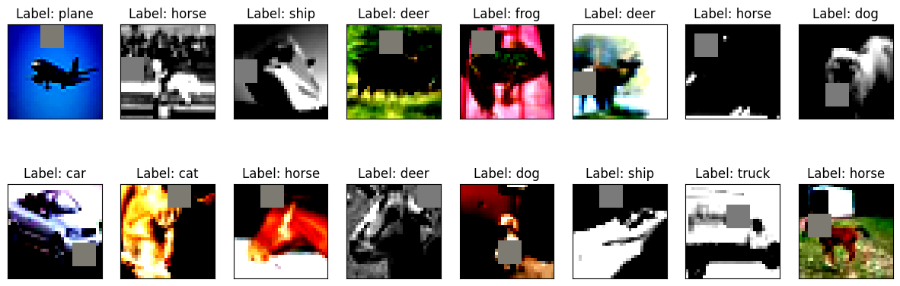
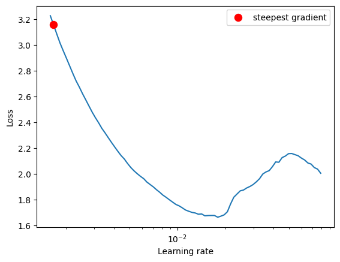
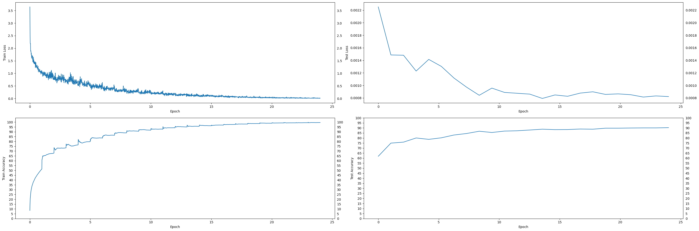
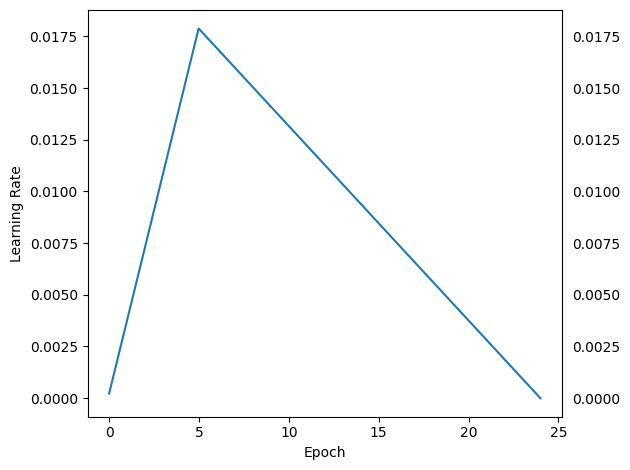
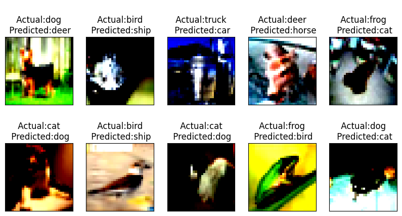
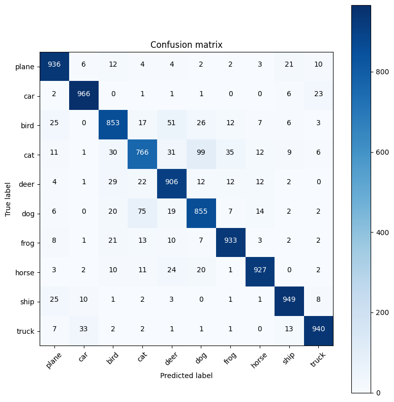

## S10 - Assignment Objective:

* Write a customLinks to an external site. ResNet architecture for CIFAR10 that has the following architecture:

1. PrepLayer - Conv 3x3 s1, p1) >> BN >> RELU [64k]
2. Layer1 -
  * X = Conv 3x3 (s1, p1) >> MaxPool2D >> BN >> RELU [128k]
  * R1 = ResBlock( (Conv-BN-ReLU-Conv-BN-ReLU))(X) [128k]
  * Add(X, R1)
3. Layer 2 -
  * Conv 3x3 [256k]
  * MaxPooling2D
  * BN
  * ReLU
4. Layer 3 -
  * X = Conv 3x3 (s1, p1) >> MaxPool2D >> BN >> RELU [512k]
  * R2 = ResBlock( (Conv-BN-ReLU-Conv-BN-ReLU))(X) [512k]
  * Add(X, R2)
  * MaxPooling with Kernel Size 4
  * FC Layer
  * SoftMax
5. Uses One Cycle Policy such that:
  *  Total Epochs = 24
  *  Max at Epoch = 5
  *  LRMIN = FIND
  *  LRMAX = FIND
  *  NO Annihilation
6. Uses this transform
  * RandomCrop 32, 32 (after padding of 4)
  * FlipLR
  * Followed by CutOut(8, 8)
  * Batch size = 512
  * Use ADAM, and CrossEntropyLoss
  * Target Accuracy: 90%

7. NO score if your code is not modular. Your collab must be importing your GitHub package, and then just running the model. I should be able to find the custom_resnet.py model in your GitHub repo that you'd be training.
8. Once done, proceed to answer the Assignment-Solution page.

-----
## Load helper modules

```
!rm -rf models
!git clone https://github.com/PyarakaSrikanth/ERAV1_Utils -q --quiet
!mv ERAV1_Utils/* .
print("Loaded ERAV1 Modules and Models")
!rm -rf ERAV1_Utils

```

-----
## Project Files:
* models folder has [custom_resnet_.py](models/custom_resnet_.py) : Contains Model Architecture
* [data.py](data.py)  : CIFAR10 data definition
* [utils.py](utils.py) : Contains helper funtions modularized to check stats,data loader,train and test etc
* [visualize.py](visualize.py) : Contains functions to create visualization of samples
* [transformation.py](transformation.py) : Contains funtions to normalize and data augmentation using albumentations package
* [S10_Assignment.ipynb](S9_Assignment.ipynb) : Contains implemntation code

## Model Summary :
* Total Parameters : 162,296 (<200k)


```
----------------------------------------------------------------
        Layer (type)               Output Shape         Param #
================================================================
            Conv2d-1           [-1, 64, 32, 32]           1,792
              ReLU-2           [-1, 64, 32, 32]               0
       BatchNorm2d-3           [-1, 64, 32, 32]             128
            Conv2d-4          [-1, 128, 32, 32]          73,856
         MaxPool2d-5          [-1, 128, 16, 16]               0
              ReLU-6          [-1, 128, 16, 16]               0
       BatchNorm2d-7          [-1, 128, 16, 16]             256
            Conv2d-8          [-1, 128, 16, 16]         147,584
              ReLU-9          [-1, 128, 16, 16]               0
      BatchNorm2d-10          [-1, 128, 16, 16]             256
           Conv2d-11          [-1, 128, 16, 16]         147,584
             ReLU-12          [-1, 128, 16, 16]               0
      BatchNorm2d-13          [-1, 128, 16, 16]             256
           Conv2d-14          [-1, 256, 16, 16]         295,168
        MaxPool2d-15            [-1, 256, 8, 8]               0
             ReLU-16            [-1, 256, 8, 8]               0
      BatchNorm2d-17            [-1, 256, 8, 8]             512
           Conv2d-18            [-1, 512, 8, 8]       1,180,160
        MaxPool2d-19            [-1, 512, 4, 4]               0
             ReLU-20            [-1, 512, 4, 4]               0
      BatchNorm2d-21            [-1, 512, 4, 4]           1,024
          Dropout-22            [-1, 512, 4, 4]               0
           Conv2d-23            [-1, 512, 4, 4]       2,359,808
             ReLU-24            [-1, 512, 4, 4]               0
      BatchNorm2d-25            [-1, 512, 4, 4]           1,024
           Conv2d-26            [-1, 512, 4, 4]       2,359,808
             ReLU-27            [-1, 512, 4, 4]               0
      BatchNorm2d-28            [-1, 512, 4, 4]           1,024
        MaxPool2d-29            [-1, 512, 1, 1]               0
           Linear-30                   [-1, 10]           5,130
================================================================
Total params: 6,575,370
Trainable params: 6,575,370
Non-trainable params: 0
----------------------------------------------------------------
Input size (MB): 0.01
Forward/backward pass size (MB): 6.50
Params size (MB): 25.08
Estimated Total Size (MB): 31.60
----------------------------------------------------------------
```

## Augumentation Code :
* Implemented in transformation.py file
	 * RandomCrop 32, 32 (after padding of 4)
     * FlipLR
     * Followed by CutOut(8, 8)

```
def get_train_aug_transform(mu, sigma):

    """
    Args:
        tensor (Tensor): Tensor image of size (C, H, W) to be normalized.
    Returns:
        Tensor: Normalized image.
    """
    

    train_transform = A.Compose([
                             A.RandomCrop(32,32), 
                             A.HorizontalFlip(p=0.5),
                             A.Normalize(mean=(mu), 
                                         std=(sigma)),
                             A.Cutout(num_holes=1, 
                                      max_h_size=8,
                                      max_w_size=8, 
                                      fill_value=(mu),
                                      #fill_value=[0.4914*255, 0.4822*255, 0.4471*255], 
                                      always_apply=True,
                                      p=0.50),   
                             A.ToGray(),         
                             ToTensorV2(),
])

    return(train_transform)


```
## Sample after tranformation :


## Training Results :
* Test Accuracy : 90.31% achieved at 24 Epoch
* Trained for 24 epochs
* Used Adam optimizer (lr=1e-3, weight decay = 1e-7) with crossenthropy loss
* Used LRFinder with (end_lr=0.1, num_iter=100, step_mode='exp')
* Max LR = 0.01788649529057435
* Min LR = -7.81645607837722e-06
* Used OneCycleLR scheduler with (max_lr=max_lr, pct_start=5/EPOCHS, div_factor=100, three_phase=False, final_div_factor=100, anneal_strategy='linear')


## Training and Test accuracy Log ( 24 epochs) :
```
EPOCH = 1 | LR = 0.003727633405035648 | Loss = 1.11 | Batch = 97 | Accuracy = 51.33: 100%|██████████| 98/98 [00:24<00:00,  4.01it/s]
Test set: Average loss: 0.0023, Accuracy: 6188/10000 (61.88%)

EPOCH = 2 | LR = 0.007276401857165553 | Loss = 0.75 | Batch = 97 | Accuracy = 67.91: 100%|██████████| 98/98 [00:22<00:00,  4.33it/s]
Test set: Average loss: 0.0015, Accuracy: 7495/10000 (74.95%)

EPOCH = 3 | LR = 0.010825170309295458 | Loss = 0.66 | Batch = 97 | Accuracy = 73.39: 100%|██████████| 98/98 [00:22<00:00,  4.44it/s]
Test set: Average loss: 0.0015, Accuracy: 7593/10000 (75.93%)

EPOCH = 4 | LR = 0.014373938761425361 | Loss = 0.53 | Batch = 97 | Accuracy = 76.50: 100%|██████████| 98/98 [00:22<00:00,  4.34it/s]
Test set: Average loss: 0.0012, Accuracy: 8006/10000 (80.06%)

EPOCH = 5 | LR = 0.017876890184966916 | Loss = 0.61 | Batch = 97 | Accuracy = 79.81: 100%|██████████| 98/98 [00:23<00:00,  4.22it/s]
Test set: Average loss: 0.0014, Accuracy: 7868/10000 (78.68%)

EPOCH = 6 | LR = 0.016935589835438216 | Loss = 0.64 | Batch = 97 | Accuracy = 83.54: 100%|██████████| 98/98 [00:22<00:00,  4.29it/s]
Test set: Average loss: 0.0013, Accuracy: 8022/10000 (80.22%)

EPOCH = 7 | LR = 0.015994289485909516 | Loss = 0.48 | Batch = 97 | Accuracy = 86.35: 100%|██████████| 98/98 [00:22<00:00,  4.39it/s]
Test set: Average loss: 0.0011, Accuracy: 8300/10000 (83.00%)

EPOCH = 8 | LR = 0.015052989136380817 | Loss = 0.33 | Batch = 97 | Accuracy = 88.87: 100%|██████████| 98/98 [00:22<00:00,  4.41it/s]
Test set: Average loss: 0.0010, Accuracy: 8449/10000 (84.49%)

EPOCH = 9 | LR = 0.014111688786852117 | Loss = 0.22 | Batch = 97 | Accuracy = 90.53: 100%|██████████| 98/98 [00:22<00:00,  4.35it/s]
Test set: Average loss: 0.0008, Accuracy: 8675/10000 (86.75%)

EPOCH = 10 | LR = 0.013170388437323417 | Loss = 0.19 | Batch = 97 | Accuracy = 91.62: 100%|██████████| 98/98 [00:22<00:00,  4.29it/s]
Test set: Average loss: 0.0010, Accuracy: 8550/10000 (85.50%)

EPOCH = 11 | LR = 0.012229088087794718 | Loss = 0.31 | Batch = 97 | Accuracy = 92.66: 100%|██████████| 98/98 [00:23<00:00,  4.15it/s]
Test set: Average loss: 0.0009, Accuracy: 8689/10000 (86.89%)

EPOCH = 12 | LR = 0.011287787738266018 | Loss = 0.15 | Batch = 97 | Accuracy = 94.12: 100%|██████████| 98/98 [00:22<00:00,  4.44it/s]
Test set: Average loss: 0.0009, Accuracy: 8721/10000 (87.21%)

EPOCH = 13 | LR = 0.010346487388737318 | Loss = 0.15 | Batch = 97 | Accuracy = 95.00: 100%|██████████| 98/98 [00:22<00:00,  4.31it/s]
Test set: Average loss: 0.0009, Accuracy: 8795/10000 (87.95%)

EPOCH = 14 | LR = 0.00940518703920862 | Loss = 0.12 | Batch = 97 | Accuracy = 95.63: 100%|██████████| 98/98 [00:22<00:00,  4.28it/s]
Test set: Average loss: 0.0008, Accuracy: 8878/10000 (88.78%)

EPOCH = 15 | LR = 0.00846388668967992 | Loss = 0.12 | Batch = 97 | Accuracy = 96.30: 100%|██████████| 98/98 [00:22<00:00,  4.34it/s]
Test set: Average loss: 0.0008, Accuracy: 8834/10000 (88.34%)

EPOCH = 16 | LR = 0.007522586340151221 | Loss = 0.06 | Batch = 97 | Accuracy = 96.89: 100%|██████████| 98/98 [00:23<00:00,  4.25it/s]
Test set: Average loss: 0.0008, Accuracy: 8843/10000 (88.43%)

EPOCH = 17 | LR = 0.006581285990622521 | Loss = 0.05 | Batch = 97 | Accuracy = 97.60: 100%|██████████| 98/98 [00:22<00:00,  4.43it/s]
Test set: Average loss: 0.0009, Accuracy: 8894/10000 (88.94%)

EPOCH = 18 | LR = 0.005639985641093819 | Loss = 0.06 | Batch = 97 | Accuracy = 97.97: 100%|██████████| 98/98 [00:23<00:00,  4.23it/s]
Test set: Average loss: 0.0009, Accuracy: 8877/10000 (88.77%)

EPOCH = 19 | LR = 0.00469868529156512 | Loss = 0.09 | Batch = 97 | Accuracy = 98.51: 100%|██████████| 98/98 [00:23<00:00,  4.23it/s]
Test set: Average loss: 0.0009, Accuracy: 8977/10000 (89.77%)

EPOCH = 20 | LR = 0.00375738494203642 | Loss = 0.03 | Batch = 97 | Accuracy = 98.83: 100%|██████████| 98/98 [00:22<00:00,  4.30it/s]
Test set: Average loss: 0.0009, Accuracy: 8977/10000 (89.77%)

EPOCH = 21 | LR = 0.0028160845925077217 | Loss = 0.02 | Batch = 97 | Accuracy = 99.16: 100%|██████████| 98/98 [00:22<00:00,  4.27it/s]
Test set: Average loss: 0.0009, Accuracy: 8995/10000 (89.95%)

EPOCH = 22 | LR = 0.0018747842429790197 | Loss = 0.01 | Batch = 97 | Accuracy = 99.29: 100%|██████████| 98/98 [00:23<00:00,  4.26it/s]
Test set: Average loss: 0.0008, Accuracy: 9007/10000 (90.07%)

EPOCH = 23 | LR = 0.000933483893450323 | Loss = 0.01 | Batch = 97 | Accuracy = 99.42: 100%|██████████| 98/98 [00:23<00:00,  4.21it/s]
Test set: Average loss: 0.0008, Accuracy: 9007/10000 (90.07%)

EPOCH = 24 | LR = -7.81645607837722e-06 | Loss = 0.02 | Batch = 97 | Accuracy = 99.56: 100%|██████████| 98/98 [00:23<00:00,  4.21it/s]
Test set: Average loss: 0.0008, Accuracy: 9031/10000 (90.31%)

```

## LR Finder Graph :


## Train_Test Accuracy vs Loss Graph : 


## LR History Graph :


## Misclassified images:


## Confusion Matrix:
